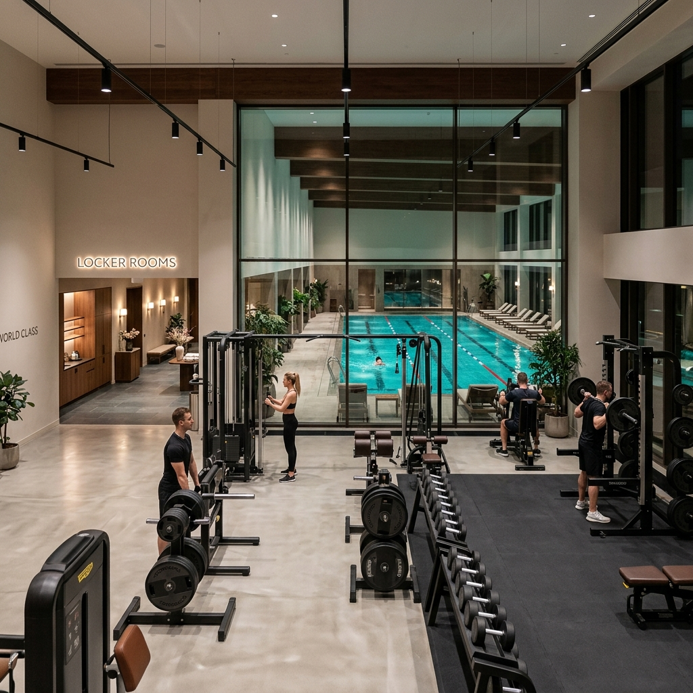
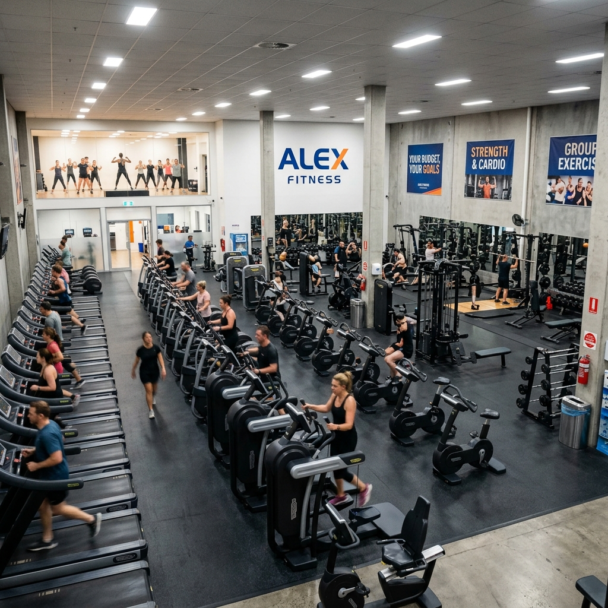
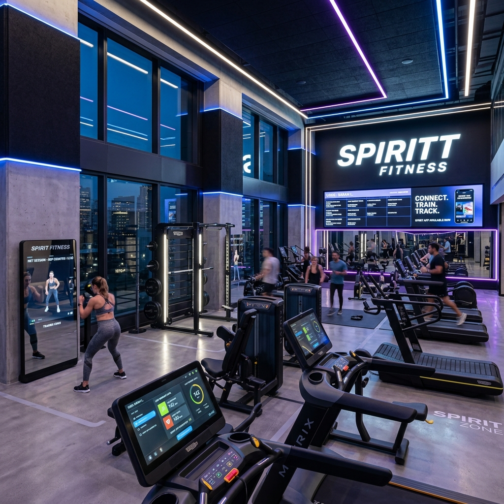

# Этап 2. Проведение предпроектных исследований

**Тема проекта:** Сервис фитнес-клуба (Абонементы, тренировки и посещаемость)  
**Дата выполнения:** 24.04.2026  

---

## 1. Цель этапа

Собрать и оформить исходные данные о проблемах, пользователях и существующих аналогах в сфере фитнес-услуг. Определить ключевые потребности целевой аудитории на основе анализа реальных отзывов клиентов крупнейших фитнес-сетей России.

---

## 2. Описание проблемы

В большинстве фитнес-клубов процесс взаимодействия клиента с клубом построен неэффективно:
- запись на тренировки осуществляется по телефону или через администратора;
- отсутствует онлайн-доступ к остатку занятий по абонементу;
- учёт посещаемости ведётся вручную;
- клиенты не получают своевременных уведомлений об изменениях в расписании.

Эти проблемы подтверждаются реальными отзывами клиентов фитнес-клубов.

---

## 3. Анализ реальных отзывов клиентов фитнес-клубов

Вместо анкетирования проведён анализ реальных отзывов посетителей четырёх крупнейших сетей фитнес-клубов России. Отзывы собраны с площадок: Яндекс Карты, 2ГИС, Отзовик, IRecommend.

### 3.1. World Class (Премиум-сегмент)

**Рейтинг:** 4.0–4.7 (Яндекс Карты)  
**Сегмент:** Премиум  
**Стоимость абонемента:** от 40 000 ₽/год

#### Реальные отзывы клиентов:

> *«Отличное оборудование и бассейн, но раздевалки давно не ремонтировались. За такие деньги ожидаешь большего. Записаться на групповое занятие можно только через приложение, но оно часто глючит.»*  
> — Яндекс Карты, 2024

> *«Тренеры — профессионалы высочайшего уровня. Хожу ради конкретного инструктора. Но в часы пик невозможно подступиться к популярным тренажёрам.»*  
> — Отзовик, 2024

> *«Пытался расторгнуть договор — это квест на целый месяц. Звонил, писал, приходил лично. Бюрократия на уровне госучреждения.»*  
> — 2ГИС, 2025

**Выявленные проблемы:**
- Устаревшее состояние раздевалок и душевых
- Перегруженность залов в часы пик
- Сложности с расторжением договоров
- Проблемы с мобильным приложением

---

### 3.2. DDX Fitness (Лоукостер/Средний сегмент)

**Рейтинг:** 4.4–5.0 (Яндекс Карты)  
**Сегмент:** Лоукостер / Средний  
**Стоимость абонемента:** от 6 000 ₽/год

#### Реальные отзывы клиентов:

> *«За такие деньги — просто шикарно! Современные тренажёры, хаммам, сауна. Единственный минус — в вечернее время очень много людей, очереди к каждому тренажёру.»*  
> — Яндекс Карты, 2024

> *«Проблема с записью на групповые — запись открывается утром, и через 5 минут все места уже заняты. Нужна нормальная система бронирования, а не кто первый встал.»*  
> — IRecommend, 2024

> *«Оформлял абонемент — менеджер навязал кучу допуслуг. Потом выяснилось, что отменить их можно только лично в клубе. Приложение показывает один остаток занятий, администратор — другой.»*  
> — 2ГИС, 2025

**Выявленные проблемы:**
- Критическая загруженность в часы пик
- Неудобная система записи на групповые тренировки
- Расхождение данных между приложением и реальностью
- Навязчивые продажи дополнительных услуг

---

### 3.3. Alex Fitness (Эконом-сегмент)

**Рейтинг:** 3.5–4.2 (Яндекс Карты)  
**Сегмент:** Эконом  
**Стоимость абонемента:** от 4 000 ₽/год

#### Реальные отзывы клиентов:

> *«Главный плюс — цена. Для студента самое то. Но вентиляция ужасная, в зале очень душно. Половина тренажёров постоянно сломана, ремонтируют неделями.»*  
> — Отзовик, 2024

> *«Записалась на пробное занятие по йоге. Пришла — тренер заболел, занятие отменили. Никто даже не предупредил! Нет никакой системы оповещения клиентов.»*  
> — Яндекс Карты, 2025

> *«Купил абонемент на год, через месяц решил расторгнуть. Начались звонки каждый день: "Может, передумаете?" Договор составлен так, что вернуть деньги практически невозможно.»*  
> — 2ГИС, 2024

**Выявленные проблемы:**
- Плохая вентиляция и санитарное состояние
- Отсутствие системы уведомлений об отмене тренировок
- Неисправное оборудование
- Сложности с расторжением договоров и возвратом средств

---

### 3.4. Spirit Fitness (Средний/Технологичный сегмент)

**Рейтинг:** 4.4–4.9 (Яндекс Карты)  
**Сегмент:** Средний / Технологичный  
**Стоимость абонемента:** от 8 000 ₽/год

#### Реальные отзывы клиентов:

> *«Нравится, что можно через приложение посмотреть загруженность зала в реальном времени. Современный интерьер в стиле лофт, хорошие тренажёры. Круглосуточный режим — огромный плюс.»*  
> — Яндекс Карты, 2024

> *«Раздевалки маловаты для такого потока людей. В часы пик — давка. А в целом клуб хороший, тренеры внимательные.»*  
> — Zoon, 2024

> *«Хочется, чтобы в приложении показывался остаток занятий по абонементу и была история посещений. Сейчас это можно узнать только у администратора.»*  
> — IRecommend, 2025

**Выявленные проблемы:**
- Тесные раздевалки при большом потоке
- Отсутствие полной информации об абонементе в приложении
- Нет истории посещений для клиента

---

## 4. Сводная таблица сравнения фитнес-клубов

| Критерий | World Class | DDX Fitness | Alex Fitness | Spirit Fitness |
|:---|:---|:---|:---|:---|
| **Сегмент** | Премиум | Лоукостер | Эконом | Средний |
| **Рейтинг (Яндекс)** | 4.0–4.7 | 4.4–5.0 | 3.5–4.2 | 4.4–4.9 |
| **Стоимость (год)** | от 40 000 ₽ | от 6 000 ₽ | от 4 000 ₽ | от 8 000 ₽ |
| **Онлайн-запись** | Через приложение | Частично | Нет | Через приложение |
| **Учёт абонемента** | В приложении | Частично | Только администратор | Частично |
| **Уведомления** | Push-уведомления | Нет | Нет | Push-уведомления |
| **Контроль загруженности** | Нет | Нет | Нет | Да (в приложении) |
| **Удобство расторжения** | Сложно | Сложно | Очень сложно | Средне |
| **Главный плюс** | Качество оборудования | Цена/качество | Низкая цена | Технологичность |
| **Главный минус** | Раздевалки, цена | Загруженность | Состояние залов | Тесные раздевалки |

---

## 5. Выводы из анализа отзывов

На основе анализа реальных отзывов клиентов четырёх крупнейших фитнес-сетей выявлены следующие ключевые проблемы, которые должна решить проектируемая система:

### Топ-5 проблем клиентов (по частоте упоминания):

| № | Проблема | Частота | Решение в нашей системе |
|:--|:---|:---|:---|
| 1 | **Загруженность залов** — невозможно записаться, очереди к тренажёрам | Очень высокая | Отображение заполненности тренировок в реальном времени |
| 2 | **Отсутствие информации об абонементе** — остаток занятий, срок действия | Высокая | Виджет в личном кабинете с полной информацией |
| 3 | **Нет уведомлений** — об отмене тренировок, изменениях расписания | Высокая | Модуль автоматических уведомлений |
| 4 | **Неудобная запись** — только через телефон или на ресепшене | Средняя | Онлайн-запись в 1 клик через веб-приложение |
| 5 | **Расхождение данных** — приложение показывает одно, администратор — другое | Средняя | Единая база данных для всех участников |

---

## 6. Профили целевых пользователей

### Профиль 1: Клиент

| Параметр | Описание |
|:---|:---|
| **Возраст** | 20–45 лет |
| **Частота тренировок** | 2–4 раза в неделю |
| **Боли** | Неудобная запись, незнание остатка по абонементу, отсутствие уведомлений |
| **Ожидания** | Быстрая запись со смартфона, прозрачная информация об абонементе |

### Профиль 2: Тренер

| Параметр | Описание |
|:---|:---|
| **Возраст** | 25–40 лет |
| **Нагрузка** | 4–8 тренировок в день |
| **Боли** | Бумажные журналы, незнание кто записался, ручная отметка |
| **Ожидания** | Электронный список с отметкой явки в 1 клик |

### Профиль 3: Администратор

| Параметр | Описание |
|:---|:---|
| **Возраст** | 22–35 лет |
| **Нагрузка** | Полный рабочий день на ресепшене |
| **Боли** | Очереди, ручной учёт, формирование отчётов в Excel |
| **Ожидания** | Автоматическая отчётность, управление из единого интерфейса |

---

## 7. Итоги предпроектного исследования

1. Рынок фитнес-услуг в России представлен клубами различных ценовых сегментов, но **ни одна** из рассмотренных сетей не предоставляет клиентам полностью удобный цифровой сервис.
2. Ключевые проблемы (загруженность, отсутствие информации, неудобная запись) являются **общими для всех сегментов** — от эконома до премиума.
3. Проектируемая система должна в первую очередь обеспечить: прозрачную онлайн-запись, отображение остатка по абонементу и автоматические уведомления.
4. Технологичные решения (Spirit Fitness) показывают более высокий рейтинг — значит, цифровизация напрямую влияет на удовлетворённость клиентов.
