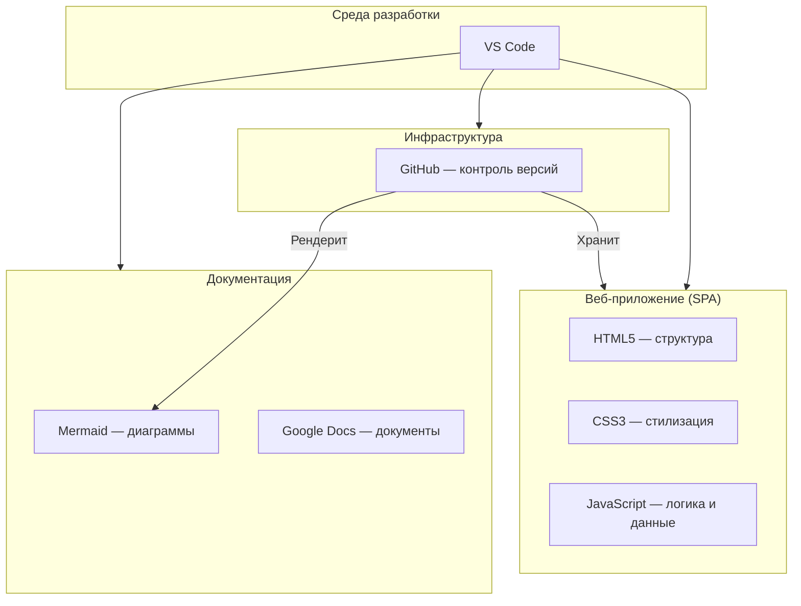

# Этап 3. Выбор и обоснование среды проектирования

**Тема проекта:** Сервис фитнес-клуба (Абонементы, тренировки и посещаемость)  
**Дата выполнения:** 24.04.2026  

---

## 1. Назначение этапа

Определить набор программных средств и сервисов, которые будут использоваться на всех стадиях проектирования и разработки: от описания требований до развёртывания готового приложения. Обосновать выбор каждого инструмента.

---

## 2. Краткое описание проекта

| Параметр | Значение |
|:---|:---|
| **Тема** | Сервис фитнес-клуба |
| **Целевая аудитория** | Клиенты, тренеры, администраторы |
| **Тип продукта** | Веб-приложение (SPA) |
| **Задача** | Автоматизация записи на тренировки, управления абонементами и учёта посещаемости |
| **Необходимые артефакты** | Документация, UML-диаграммы, исходный код, тесты |

---

## 3. Перечень выбранных инструментов

| № | Инструмент | Назначение |
|:--|:---|:---|
| 1 | **Visual Studio Code** | Среда разработки (IDE) |
| 2 | **HTML5** | Структура страниц приложения |
| 3 | **CSS3** | Стилизация интерфейса |
| 4 | **JavaScript (ES6+)** | Логика приложения, работа с данными |
| 5 | **Mermaid** | UML-диаграммы и схемы |
| 6 | **GitHub** | Контроль версий и хранение артефактов |
| 7 | **Google Docs** | Текстовая документация |

---

## 4. Обоснование выбора каждого инструмента

### 4.1. Visual Studio Code (IDE)

| Критерий | Значение |
|:---|:---|
| **Что делает** | Среда для написания и отладки кода на всех используемых языках |
| **Почему выбран** | Бесплатный, кроссплатформенный, поддерживает все нужные языки (JS, HTML/CSS). Обширная экосистема расширений (Prettier, Live Server, ESLint). Встроенный терминал и Git-интеграция |
| **Альтернативы** | WebStorm (платный), Sublime Text (менее функциональный) |

### 4.2. HTML5 (Структура)

| Критерий | Значение |
|:---|:---|
| **Что делает** | Определяет структуру и семантику страниц приложения |
| **Почему выбран** | Стандарт веб-разработки, поддерживается всеми браузерами, семантические теги улучшают доступность |
| **Альтернативы** | Шаблонизаторы (Pug, EJS) — избыточны для данного масштаба |

### 4.3. CSS3 (Стилизация)

| Критерий | Значение |
|:---|:---|
| **Что делает** | Стилизация интерфейса: цвета, отступы, анимации, адаптивность |
| **Почему выбран** | Нативная технология, CSS-переменные обеспечивают гибкую систему дизайна, Flexbox и Grid — мощные инструменты для адаптивной вёрстки без сторонних библиотек |
| **Альтернативы** | Tailwind CSS (требует сборщика), Bootstrap (ограничивает дизайн) |

### 4.4. JavaScript ES6+ (Логика)

| Критерий | Значение |
|:---|:---|
| **Что делает** | Вся бизнес-логика приложения: авторизация, запись на тренировки, управление абонементами, рендеринг интерфейса |
| **Почему выбран** | Нативный язык браузера, не требует сборщиков и фреймворков. ES6+ обеспечивает удобный синтаксис (arrow functions, const/let, template literals). Данные хранятся в JavaScript-объектах (in-memory), что упрощает прототипирование |
| **Альтернативы** | React/Vue (избыточно для данного масштаба проекта) |

### 4.5. Mermaid (Диаграммы)

| Критерий | Значение |
|:---|:---|
| **Что делает** | Создание UML-диаграмм, блок-схем прямо в Markdown |
| **Почему выбран** | Интеграция с GitHub и VS Code, не требует отдельного приложения, код диаграмм хранится вместе с документацией, легко обновляется |
| **Альтернативы** | draw.io (требует отдельного приложения), PlantUML (менее наглядный синтаксис) |

### 4.6. GitHub (Контроль версий)

| Критерий | Значение |
|:---|:---|
| **Что делает** | Хранение кода, документации, управление задачами |
| **Почему выбран** | Де-факто стандарт для хранения проектов, бесплатный, поддержка Issues для отслеживания задач, рендеринг Mermaid-диаграмм прямо в Markdown |
| **Альтернативы** | GitLab (менее популярен), Bitbucket (ограничения) |

### 4.7. Google Docs (Документация)

| Критерий | Значение |
|:---|:---|
| **Что делает** | Создание и хранение текстовой документации, совместная работа |
| **Почему выбран** | Бесплатный, облачный доступ, экспорт в .docx и .pdf |
| **Альтернативы** | Microsoft Word (менее удобен для совместной работы) |

---

## 5. Сводная таблица

| Задача проектирования | Инструмент | Обоснование |
|:---|:---|:---|
| Написание и отладка кода | **VS Code** | Универсальная IDE с расширениями для всех языков проекта |
| Структура страниц | **HTML5** | Семантическая разметка, стандарт отрасли |
| Стилизация интерфейса | **CSS3** | CSS-переменные, Flexbox, Grid, медиа-запросы |
| Логика и данные | **JavaScript (ES6+)** | Нативный язык браузера, хранение данных в объектах |
| Диаграммы и схемы | **Mermaid** | Интеграция с GitHub, код в Markdown |
| Контроль версий | **GitHub** | Надёжное хранение кода и документации |
| Документация | **Google Docs + Markdown** | Совместная работа и техническая документация |

---

## 6. Схема взаимодействия инструментов

---

## 7. Вывод

Выбранный набор инструментов полностью покрывает все задачи проектирования и разработки программного продукта «Сервис фитнес-клуба». Приложение реализовано как одностраничное веб-приложение (SPA) на чистом HTML/CSS/JavaScript с хранением данных в JavaScript-объектах, что обеспечивает максимальную простоту развёртывания — достаточно открыть `index.html` в браузере. Все инструменты бесплатны, совместимы друг с другом и широко используются в индустрии.
