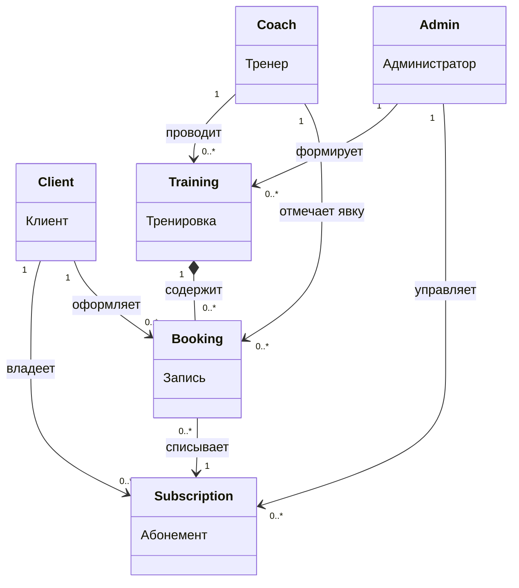
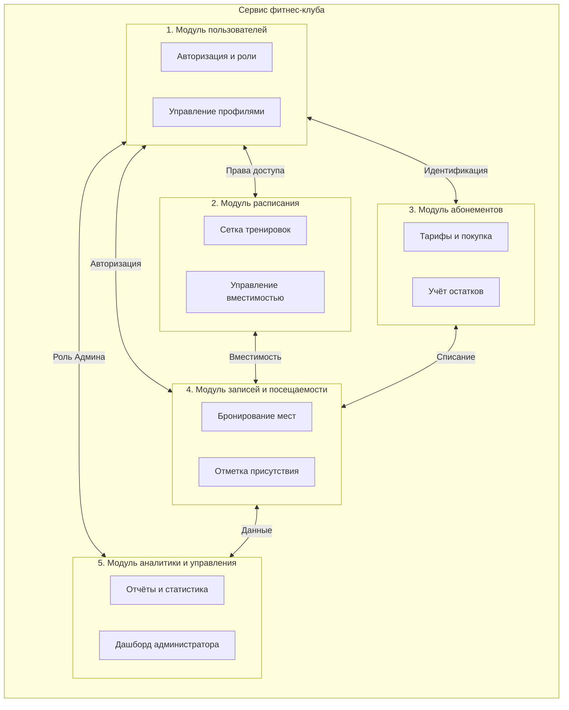
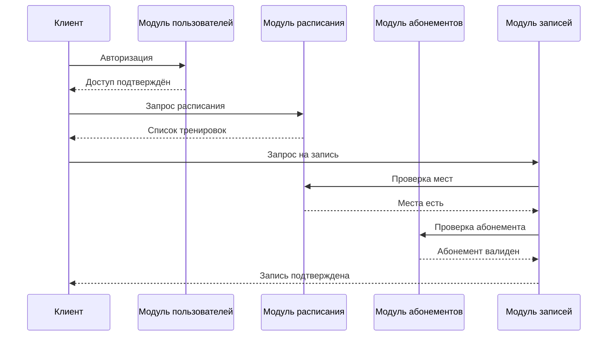

# Этап 5. Выделение ассоциаций. Декомпозиция предметной области

**Тема проекта:** Сервис фитнес-клуба (Абонементы, тренировки и посещаемость)  
**Дата выполнения:** 24.04.2026  

---

## 1. Перечень ассоциаций

| № | Ассоциация | Описание |
|:--|:---|:---|
| 1 | Клиент владеет Абонементом | Клиент приобретает абонемент для доступа к занятиям |
| 2 | Клиент оформляет Запись | Клиент бронирует место на тренировке |
| 3 | Тренер проводит Тренировку | Тренер назначается ответственным за занятие |
| 4 | Тренер отмечает Запись | Тренер фиксирует присутствие клиента |
| 5 | Администратор формирует Тренировку | Администратор создаёт расписание |
| 6 | Администратор управляет Абонементом | Администратор выдаёт и замораживает абонементы |
| 7 | Тренировка содержит Записи | Тренировка агрегирует все бронирования |
| 8 | Запись списывает с Абонемента | При посещении уменьшается остаток занятий |

---

## 2. Таблица ассоциаций с мощностями

| Сущность A | Сущность B | Мощность | Тип связи |
|:---|:---|:---|:---|
| Client | Subscription | 1 : 0..* | Ассоциация |
| Client | Booking | 1 : 0..* | Ассоциация |
| Coach | Training | 1 : 0..* | Ассоциация |
| Coach | Booking | 1 : 0..* | Ассоциация |
| Admin | Training | 1 : 0..* | Ассоциация |
| Admin | Subscription | 1 : 0..* | Ассоциация |
| Training | Booking | 1 : 0..* | Агрегация |
| Booking | Subscription | 0..* : 1 | Зависимость |

---

## 3. Схема ассоциаций

---

## 4. Декомпозиция предметной области

---

## 5. Описание подсистем

| Подсистема | Сущности | Назначение |
|:---|:---|:---|
| **1. Модуль пользователей** | User, Client, Coach, Admin | Доступ к системе, управление ролями и профилями |
| **2. Модуль расписания** | Training | Формирование сетки занятий, контроль вместимости |
| **3. Модуль абонементов** | Subscription, SubscriptionType | Продажа тарифов, учёт прав на посещение |
| **4. Модуль записей и посещаемости** | Booking | Бронирование клиентами, отметка тренерами |
| **5. Модуль аналитики и управления** | Все | Панель администратора, отчёты, статистика |

---

## 6. Диаграмма последовательности записи на тренировку

---

## 7. Вывод

Выделено 8 ассоциаций между сущностями с указанием мощностей и типов. Система строго декомпозирована на 5 функциональных модулей, закрывающих все бизнес-процессы фитнес-клуба.
