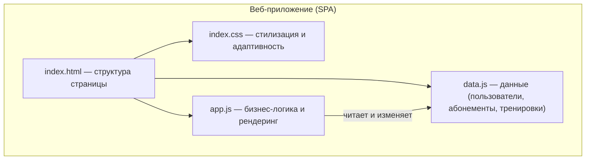
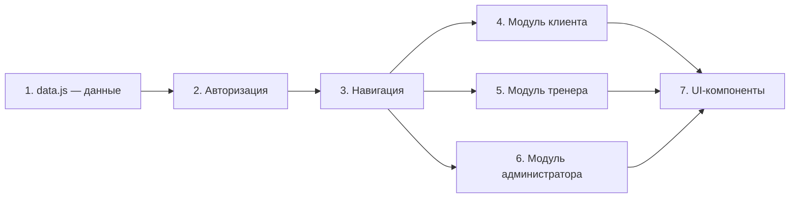
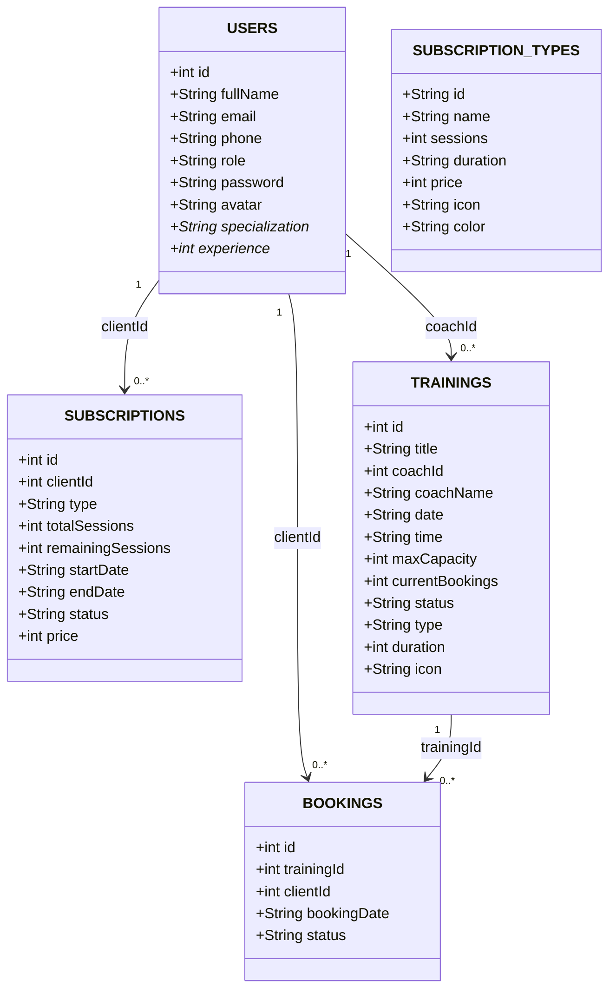

# Этап 7. Разработка модулей и интеграция

**Тема проекта:** Сервис фитнес-клуба (Абонементы, тренировки и посещаемость)  
**Дата выполнения:** 24.04.2026  

---

## 1. Назначение этапа

Определить состав модулей системы, описать их назначение и взаимосвязи, выбрать подход к интеграции.

---

## 2. Архитектура приложения

Система реализована как одностраничное веб-приложение (SPA) на чистом JavaScript. Данные хранятся в JavaScript-объектах (in-memory) — без серверной части и базы данных.

---

## 3. Перечень модулей

Приложение состоит из 4 файлов. Внутри `app.js` логика разделена на функциональные блоки (модули):

### 3.1. Файлы проекта

| № | Файл | Назначение |
|:--|:---|:---|
| 1 | `index.html` | Разметка страницы: экран входа, боковая панель, область контента |
| 2 | `index.css` | Стилизация: CSS-переменные, адаптивная вёрстка, анимации |
| 3 | `data.js` | Хранилище данных: массивы пользователей, абонементов, тренировок, записей |
| 4 | `app.js` | Вся бизнес-логика: авторизация, навигация, рендеринг, действия пользователей |

### 3.2. Функциональные модули внутри `app.js`

| № | Модуль | Функции | Назначение |
|:--|:---|:---|:---|
| 1 | Авторизация | `handleLogin()`, `logout()` | Вход и выход из системы |
| 2 | Навигация | `initApp()`, `buildNav()`, `navigateTo()`, `renderSection()` | Инициализация, боковое меню, переключение разделов |
| 3 | Клиент | `clientDashboard()`, `clientSchedule()`, `clientSubscriptions()`, `clientHistory()` | Личный кабинет, расписание, абонементы, история |
| 4 | Записи | `bookTraining()`, `cancelBooking()`, `buySub()` | Запись/отмена на тренировку, покупка абонемента |
| 5 | Тренер | `coachDashboard()`, `coachAttendance()`, `markAttendance()` | Кабинет тренера, отметка посещаемости |
| 6 | Администратор | `adminDashboard()`, `adminSchedule()`, `adminSubs()`, `adminReports()`, `adminUsers()` | Панель управления, отчёты, пользователи |
| 7 | UI-компоненты | `trainingCard()`, `showToast()`, `adminBarChart()`, `profilePage()` | Карточки тренировок, уведомления, графики |

---

## 4. Подход к интеграции

**Выбранный подход:** Инкрементальная интеграция «снизу вверх» (Bottom-Up).

| Характеристика | Описание |
|:---|:---|
| **Суть** | Сначала создаётся хранилище данных (`data.js`), затем логика работы с данными (`app.js`), затем интерфейс (`index.html` + `index.css`) |
| **Порядок** | data.js → app.js (авторизация → навигация → клиент → тренер → админ → UI) → index.html → index.css |
| **Преимущество** | Каждый функциональный блок можно проверить автономно через консоль браузера |

### Порядок интеграции

---

## 5. Описание связей между модулями

| Модуль A | Модуль B | Тип связи | Описание |
|:---|:---|:---|:---|
| data.js | Все модули app.js | Зависимость | Все модули читают и изменяют данные из глобальных массивов |
| Авторизация | Навигация | Зависимость | После входа инициализируется навигация |
| Навигация | Все секции | Управление | Навигация вызывает функции рендеринга нужной секции |
| Модуль клиента | Записи | Зависимость | Клиент использует функции бронирования |
| Модуль тренера | Записи | Зависимость | Тренер отмечает посещаемость через записи |
| UI-компоненты | Все секции | Зависимость | Карточки и уведомления используются во всех секциях |

---

## 6. Структура данных

Данные хранятся в глобальных JavaScript-массивах в файле `data.js`:

> *Поля, отмеченные `*`, присутствуют только у пользователей с ролью `coach`.

---

## 7. Вывод

Система разделена на 4 файла с чёткой ответственностью: данные отделены от логики, логика — от представления. Внутри `app.js` выделено 7 функциональных модулей. Выбран подход «снизу вверх» для последовательной интеграции. Структура данных описана диаграммой классов, отражающей реальные массивы из `data.js`.
