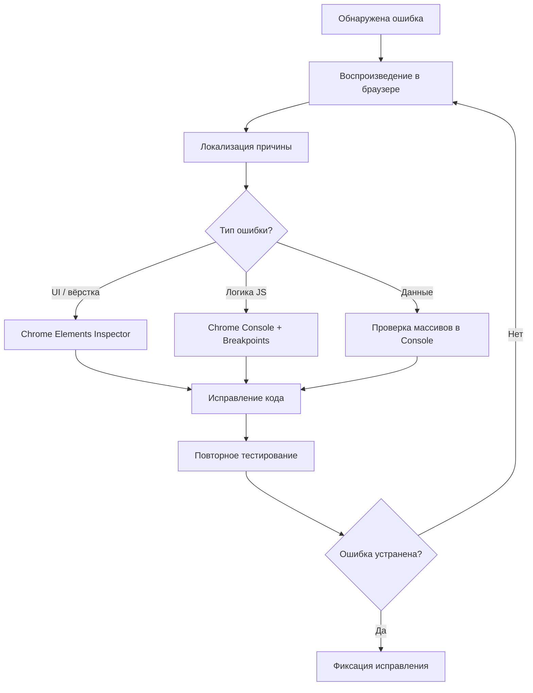

# Этап 9. Отладка, условная компиляция и спецификации

**Тема проекта:** Сервис фитнес-клуба (Абонементы, тренировки и посещаемость)  
**Дата выполнения:** 24.04.2026  

---

## 1. Назначение этапа

Проверить работоспособность модулей в различных режимах, использовать инструменты отладки и условные режимы выполнения, выявить ошибки на основе спецификаций.

---

## 2. Инструменты отладки

| Инструмент | Назначение | Применение в проекте |
|:---|:---|:---|
| **Chrome DevTools** | Отладка JS, CSS, DOM, сетевых запросов | Поиск ошибок в UI, проверка состояния переменных |
| **Console (console.log / console.error)** | Логирование в браузере | Отслеживание состояний данных при записи, отмене, покупке |
| **Chrome Breakpoints** | Пошаговая отладка JavaScript | Точки останова в функциях `bookTraining()`, `handleLogin()` |
| **Elements Inspector** | Инспектирование DOM и CSS | Проверка рендеринга карточек, таблиц, адаптивности |
| **Условный флаг DEBUG** | Режим отладки / продакшн | Вывод дополнительной информации в режиме разработки |

---

## 3. Условные режимы выполнения

В JavaScript нет компиляции в классическом смысле, но используется условный флаг для переключения режимов:

```javascript
// Условный режим отладки
const DEBUG = true;

function log(message) {
  if (DEBUG) {
    console.log(`[DEBUG ${new Date().toISOString()}]: ${message}`);
  }
}

// Использование в app.js
log('Загрузка расписания...');
log('Найдено тренировок: ' + TRAININGS.length);
log('Текущий пользователь: ' + currentUser?.fullName);
```

**Переключение в продакшн:**
```javascript
const DEBUG = false; // Все отладочные сообщения скрыты
```

---

## 4. Таблица выявленных ошибок

| № | Модуль | Описание ошибки | Причина | Способ обнаружения | Статус |
|:--|:---|:---|:---|:---|:---|
| 1 | `bookTraining()` | При записи на полную тренировку счётчик увеличивался сверх лимита | Отсутствие проверки `maxCapacity` | Chrome DevTools, console.log | ✅ Исправлено |
| 2 | `buySub()` | Можно было купить абонемент при уже активном | Отсутствие проверки `existing` | Ручное тестирование | ✅ Исправлено |
| 3 | `clientSchedule()` | Тренировки с любым статусом отображались в расписании | Нет фильтра по `status === 'scheduled'` | Визуальная проверка | ✅ Исправлено |
| 4 | `handleLogin()` | При пустых полях форма отправлялась без ошибки | Отсутствие валидации `!email \|\| !password` | Тестирование граничных значений | ✅ Исправлено |
| 5 | `cancelBooking()` | Кнопка «Отменить» не обновляла интерфейс | Не вызывался `renderSection()` после отмены | Chrome DevTools | ✅ Исправлено |

---

## 5. Спецификации системных компонентов

### 5.1. Спецификация модуля авторизации (`handleLogin`)

| Параметр | Значение |
|:---|:---|
| **Вход** | email (string) из поля `#login-email`, password (string) из `#login-password`, role (string) из `#login-role` |
| **Выход** | Переход в личный кабинет или уведомление об ошибке |
| **Предусловия** | Пользователь существует в массиве `USERS` |
| **Постусловия** | `currentUser` установлен, экран входа скрыт, приложение инициализировано |
| **Исключения** | Пустые поля → «Заполните все поля». Неверные данные → «Неверные данные для входа» |

### 5.2. Спецификация модуля записи (`bookTraining`)

| Параметр | Значение |
|:---|:---|
| **Вход** | training_id (int) — ID тренировки |
| **Выход** | Запись добавлена в `BOOKINGS` или уведомление об ошибке |
| **Предусловия** | Клиент авторизован, абонемент активен (`status === 'active'`), `remainingSessions > 0`, `currentBookings < maxCapacity` |
| **Постусловия** | Запись создана, `currentBookings++`, `remainingSessions--`, интерфейс обновлён |
| **Исключения** | Нет абонемента → «Нет активного абонемента». Нет мест → «Нет свободных мест». Уже записан → «Вы уже записаны» |

### 5.3. Спецификация модуля покупки абонемента (`buySub`)

| Параметр | Значение |
|:---|:---|
| **Вход** | typeId (string) — идентификатор типа абонемента из `SUBSCRIPTION_TYPES` |
| **Выход** | Абонемент добавлен в `SUBSCRIPTIONS` или уведомление |
| **Предусловия** | Клиент авторизован |
| **Постусловия** | Создан абонемент со статусом `active`, рассчитаны `startDate` и `endDate` |
| **Исключения** | Уже есть активный абонемент → «У вас уже есть активный абонемент» |

---

## 6. Процесс отладки (визуализация)



---

## 7. Вывод

В ходе отладки выявлено и исправлено 5 ошибок различной критичности. Использован условный флаг `DEBUG` для разделения режимов разработки и продакшена. Для каждого ключевого модуля составлены спецификации с описанием входов, выходов и исключений. Все инструменты отладки — встроенные средства браузера Chrome.
