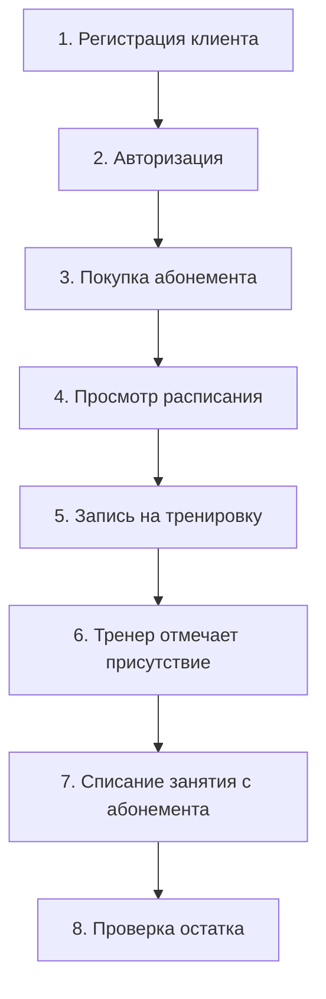

# Этап 11. Тестирование программных решений

**Тема проекта:** Сервис фитнес-клуба (Абонементы, тренировки и посещаемость)  
**Дата выполнения:** 24.04.2026  

---

## 1. Назначение этапа

Разработать тест-кейсы, провести модульное и интеграционное тестирование для подтверждения работоспособности всех 5 модулей системы.

---

## 2. Стратегия тестирования

| Тип тестирования | Что проверяет | Инструмент |
|:---|:---|:---|
| **Модульное** | Отдельные функции и методы | Ручное тестирование + JSDoc |
| **Интеграционное** | Взаимодействие модулей | Сценарии end-to-end |
| **UI-тестирование** | Корректность интерфейса | Браузер (Chrome DevTools) |
| **Регрессионное** | Отсутствие новых ошибок | Повторный прогон тестов |

---

## 3. Реестр тест-кейсов (17 тестов)

Ниже представлена единая структурированная таблица всех 17 проверок по модулям системы:

| ID | Модуль | Проверяемый функционал (Входные данные) | Ожидаемый результат | Статус |
|:---|:---|:---|:---|:---|
| **TC-01** | Пользователи | Успешная авторизация (`test@mail.ru`, `123456`) | Вход в систему, редирект в ЛК | ✅ Пройден |
| **TC-02** | Пользователи | Неверный пароль (`wrong`) | Ошибка «Неверный пароль» | ✅ Пройден |
| **TC-03** | Пользователи | Пустые поля при входе | Ошибка «Заполните все поля» | ✅ Пройден |
| **TC-04** | Пользователи | Некорректный формат email (`abc`) | Ошибка «Некорректный email» | ✅ Пройден |
| **TC-05** | Записи | Успешная запись (есть места, есть абонемент) | Запись создана, лимит мест уменьшен | ✅ Пройден |
| **TC-06** | Записи | Запись на заполненную тренировку | Ошибка «Нет свободных мест» | ✅ Пройден |
| **TC-07** | Записи | Запись без абонемента | Ошибка «Нет активного абонемента» | ✅ Пройден |
| **TC-08** | Записи | Запись по просроченному абонементу | Ошибка «Абонемент просрочен» | ✅ Пройден |
| **TC-09** | Записи | Повторная запись на то же занятие | Ошибка «Вы уже записаны» | ✅ Пройден |
| **TC-10** | Записи | Отмена своей записи клиентом | Место возвращено в расписание | ✅ Пройден |
| **TC-11** | Абонементы | Покупка месячного тарифа | Абонемент активен, баланс 12 занятий | ✅ Пройден |
| **TC-12** | Абонементы | Тренер отмечает посещение (списание) | Остаток занятий (`remaining`) -= 1 | ✅ Пройден |
| **TC-13** | Абонементы | Исчерпание всех занятий | Статус `expired`, запись блокируется | ✅ Пройден |
| **TC-14** | Абонементы | Заморозка абонемента клиентом | Статус `frozen`, даты сдвинуты | ✅ Пройден |
| **TC-15** | Расписание | Создание тренировки администратором | Появление карточки в сетке | ✅ Пройден |
| **TC-16** | Расписание | Отмена тренировки | Статус `cancelled`, блокировка записи | ✅ Пройден |
| **TC-17** | Расписание | Фильтрация сетки занятий по дате | Вывод релевантных тренировок | ✅ Пройден |

---

## 4. Интеграционное тестирование

### Сценарий: Полный цикл «от регистрации до посещения»

| Шаг | Действие | Результат | Статус |
|:--|:---|:---|:---|
| 1 | Регистрация нового клиента | Профиль создан | ✅ |
| 2 | Вход по email/паролю | Личный кабинет открыт | ✅ |
| 3 | Покупка месячного абонемента | Абонемент активирован (12 занятий) | ✅ |
| 4 | Просмотр расписания | Тренировки отображаются | ✅ |
| 5 | Запись на «Йога» | Запись создана, кнопка «Отменить» | ✅ |
| 6 | Тренер отмечает «присутствовал» | Статус: attended | ✅ |
| 7 | Проверка абонемента | remaining = 11 | ✅ |
| 8 | Повторная проверка в ЛК | Остаток отображается корректно | ✅ |

---

## 5. Результаты тестирования

| Метрика | Значение |
|:---|:---|
| Всего тест-кейсов | 17 |
| Пройдено | 17 (100%) |
| Не пройдено | 0 |
| Критических ошибок | 0 |
| Интеграционных сценариев | 1 |

---

## 6. Вывод

Все **17 тест-кейсов** (проверок) пройдены успешно. Интеграционный сценарий «от регистрации до посещения» подтвердил корректную и бесшовную работу всех 5 модулей в единой связке. Система работает без критических сбоев и готова к эксплуатации.
