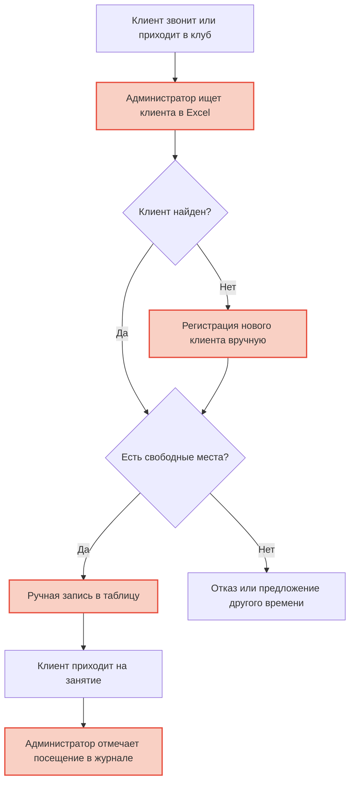
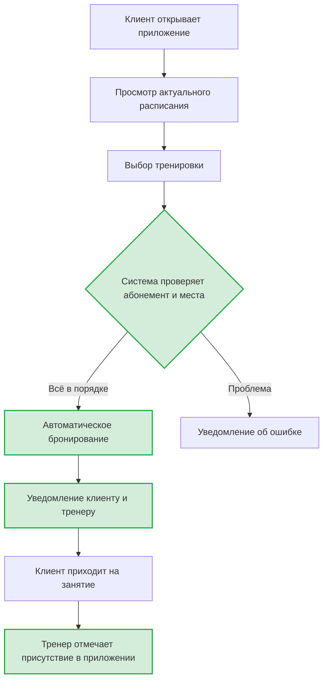
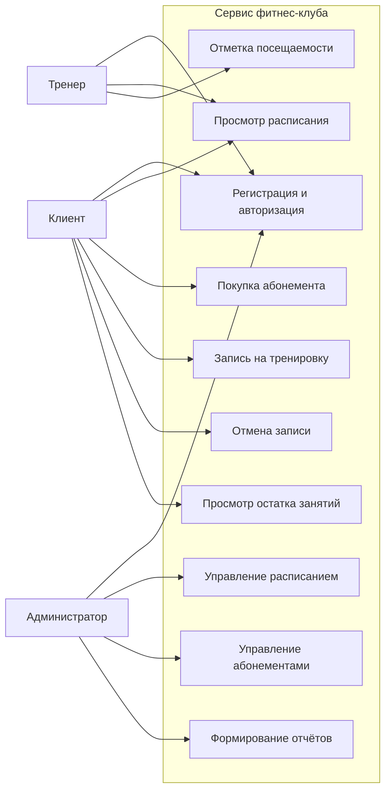

# Этап 1. Выбор и обоснование модели проектирования программного продукта

**Тема проекта:** Сервис фитнес-клуба (Абонементы, тренировки и посещаемость)  
**Дата выполнения:** 24.04.2026  

---

## 1. Краткое описание предметной области

Проект направлен на создание автоматизированной информационной системы для управления ключевыми процессами фитнес-клуба: продажей абонементов, формированием расписания тренировок и учётом посещаемости.

Система создаётся для трёх групп пользователей:

- **Клиенты** — покупают абонементы, записываются на тренировки, отслеживают остаток занятий.
- **Тренеры** — просматривают своё расписание, отмечают присутствие клиентов на занятиях.
- **Администраторы** — управляют расписанием, абонементами, формируют отчёты.

**Решаемая проблема:** В большинстве фитнес-клубов запись на тренировки и покупка абонементов до сих пор осуществляются через администратора (по телефону или лично). Это создаёт очереди, приводит к ошибкам при учёте занятий, затрудняет контроль наполняемости групп и не даёт клиентам оперативный доступ к информации об остатке тренировок.

Внедряемая система автоматизирует:
- онлайн-продажу и продление абонементов;
- самостоятельную запись клиентов на тренировки;
- электронный учёт посещаемости;
- формирование отчётности для руководства.

---

## 2. Таблица ролей пользователей

| Роль | Функции в системе | Ожидаемый результат |
|:---|:---|:---|
| **Клиент** | Регистрация/авторизация. Просмотр расписания. Покупка абонемента. Запись/отмена на тренировку. Просмотр истории посещений и остатка занятий. | Круглосуточный доступ к услугам клуба без необходимости звонить или приходить на ресепшен. |
| **Тренер** | Авторизация. Просмотр личного расписания. Просмотр списка записавшихся. Отметка присутствия клиентов. | Актуальная информация о составе группы, автоматический учёт без бумажных журналов. |
| **Администратор** | Авторизация. Управление расписанием. Управление абонементами. Управление персоналом. Просмотр статистики и отчётов. | Эффективное управление клубом, снижение рутинной работы, оперативная аналитика. |

---

## 3. Схема AS-IS (текущий процесс до внедрения системы)

**Описание:** Клиент звонит в клуб или приходит лично. Администратор вручную ищет его в таблице Excel, проверяет свободные места, делает запись. При посещении клиент предъявляет физический абонемент, администратор делает отметку о списании.

**Проблемы:** потеря времени, ошибки при записи, отсутствие у клиента актуальной информации, сложность ручного учёта.

> Красным выделены узкие места: ручные операции, подверженные ошибкам и отнимающие время.

---

## 4. Схема TO-BE (целевой процесс после внедрения системы)

**Описание:** Клиент открывает веб-приложение, видит актуальное расписание, нажимает «Записаться». Система автоматически проверяет абонемент и наличие мест, фиксирует запись. Тренер видит клиента в электронном списке и отмечает присутствие.

**Улучшения:** мгновенная запись, исключение ошибок, доступность 24/7, автоматический учёт.

> Зелёным выделены автоматизированные шаги, заменяющие ручной труд.

---

## 5. Выбор и обоснование модели проектирования

Для проекта были рассмотрены три подхода:

| Подход | Суть | Плюсы | Минусы |
|:---|:---|:---|:---|
| **Функционально-модульный** | Разделение на независимые блоки по функциям | Простота, изоляция модулей | Слабо отражает связи между пользователями и данными |
| **Процессный** | Моделирование потоков работ и оптимизация бизнес-процессов | Наглядность пути пользователя | Не даёт понимания структуры данных |
| **Объектно-ориентированный (ООП)** | Моделирование через сущности реального мира | Гибкость, масштабируемость, наследование | Требует больше времени на проектирование |

### Выбранный подход: Объектно-ориентированное проектирование (ООП)

**Обоснование:**

1. **Специфика предметной области.** Работа фитнес-клуба строится вокруг чётко выраженных сущностей: `Клиент`, `Тренер`, `Абонемент`, `Тренировка`, `Запись`. Каждая имеет свои свойства (атрибуты) и поведение (методы).

2. **Множество ролей.** Три роли пользователей (`Клиент`, `Тренер`, `Администратор`) естественно реализуются через наследование от базового класса `Пользователь`.

3. **Масштабируемость.** Если клуб введёт новые типы абонементов (семейный, корпоративный) или новые услуги (SPA, массаж), их можно добавить как новые классы без переписывания существующего кода.

4. **Наглядность.** ООП-подход позволяет использовать UML-диаграммы: Use Case покажет действия каждой роли, а диаграмма классов станет основой для проектирования базы данных.

---

## 6. Диаграмма прецедентов (Use Case)

---

## 7. Вывод

Объектно-ориентированный подход к проектированию является оптимальным для системы «Сервис фитнес-клуба», так как предметная область естественно описывается через взаимодействующие объекты с чёткими свойствами и поведением. Это обеспечивает гибкость при разработке, удобство масштабирования и наглядность при документировании проектных решений.
