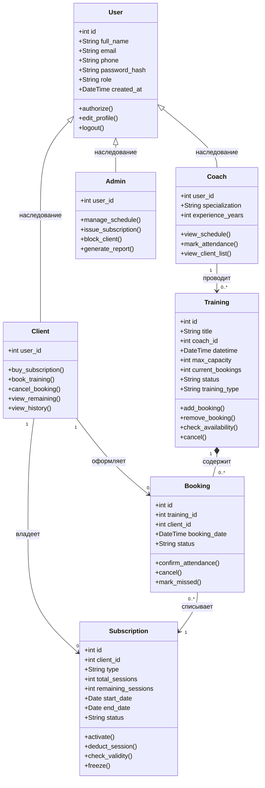

# Этап 4. Выделение классов, атрибутов и операций. Входные и выходные данные

**Тема проекта:** Сервис фитнес-клуба (Абонементы, тренировки и посещаемость)  
**Дата выполнения:** 24.04.2026  

---

## 1. Перечень классов предметной области

На основе анализа предметной области и предпроектного исследования выделены следующие ключевые сущности:

| № | Класс | Описание |
|:--|:---|:---|
| 1 | **User** (Пользователь) | Базовый класс для всех участников системы |
| 2 | **Client** (Клиент) | Наследник User. Покупает абонементы и записывается на тренировки |
| 3 | **Coach** (Тренер) | Наследник User. Проводит тренировки и отмечает посещаемость |
| 4 | **Admin** (Администратор) | Наследник User. Управляет расписанием, абонементами и персоналом |
| 5 | **Subscription** (Абонемент) | Право клиента на посещение занятий |
| 6 | **Training** (Тренировка) | Запланированное занятие в расписании |
| 7 | **Booking** (Запись) | Факт бронирования места на тренировку |

---

## 2. Детальное описание классов

### 2.1. User (Пользователь)

| Атрибут | Тип | Описание |
|:---|:---|:---|
| `id` | int | Уникальный идентификатор |
| `full_name` | string | Полное имя (ФИО) |
| `email` | string | Электронная почта |
| `phone` | string | Номер телефона |
| `password_hash` | string | Хэш пароля |
| `role` | string | Роль: client / coach / admin |
| `created_at` | datetime | Дата регистрации |

| Операция | Описание |
|:---|:---|
| `authorize(email, password)` | Аутентификация пользователя |
| `edit_profile(data)` | Обновление профиля |
| `logout()` | Выход из системы |

---

### 2.2. Client (Клиент)

Наследует все атрибуты и операции от User.

| Атрибут | Тип | Описание |
|:---|:---|:---|
| `user_id` | int | Ссылка на базовый профиль |

| Операция | Описание |
|:---|:---|
| `buy_subscription(type)` | Покупка абонемента выбранного типа |
| `book_training(training_id)` | Запись на тренировку |
| `cancel_booking(booking_id)` | Отмена записи |
| `view_remaining()` | Просмотр остатка занятий |
| `view_history()` | Просмотр истории посещений |

---

### 2.3. Coach (Тренер)

| Атрибут | Тип | Описание |
|:---|:---|:---|
| `user_id` | int | Ссылка на базовый профиль |
| `specialization` | string | Специализация (йога, силовые, кардио) |
| `experience_years` | int | Стаж работы (лет) |

| Операция | Описание |
|:---|:---|
| `view_schedule()` | Просмотр личного расписания |
| `mark_attendance(booking_id, status)` | Отметка присутствия клиента |
| `view_client_list(training_id)` | Просмотр списка записавшихся |

---

### 2.4. Admin (Администратор)

| Атрибут | Тип | Описание |
|:---|:---|:---|
| `user_id` | int | Ссылка на базовый профиль |

| Операция | Описание |
|:---|:---|
| `manage_schedule(action, data)` | Добавление/редактирование/отмена тренировок |
| `issue_subscription(client_id, type)` | Выдача абонемента клиенту |
| `block_client(client_id)` | Блокировка клиента |
| `generate_report(type, period)` | Формирование отчёта по посещаемости/продажам |

---

### 2.5. Subscription (Абонемент)

| Атрибут | Тип | Описание |
|:---|:---|:---|
| `id` | int | Уникальный идентификатор |
| `client_id` | int | Владелец абонемента |
| `type` | string | Тип: Разовый / Месячный / Годовой |
| `total_sessions` | int | Общее количество занятий |
| `remaining_sessions` | int | Остаток занятий |
| `start_date` | date | Дата начала действия |
| `end_date` | date | Дата окончания действия |
| `status` | string | Статус: active / frozen / expired |

| Операция | Описание |
|:---|:---|
| `activate()` | Активация абонемента |
| `deduct_session()` | Списание одного занятия |
| `check_validity()` | Проверка срока действия и остатка |
| `freeze(days)` | Заморозка абонемента на указанный срок |

---

### 2.6. Training (Тренировка)

| Атрибут | Тип | Описание |
|:---|:---|:---|
| `id` | int | Уникальный идентификатор |
| `title` | string | Название тренировки |
| `coach_id` | int | Тренер, проводящий занятие |
| `datetime` | datetime | Дата и время проведения |
| `max_capacity` | int | Максимальное количество мест |
| `current_bookings` | int | Текущее число записавшихся |
| `status` | string | Статус: scheduled / cancelled / completed |
| `training_type` | string | Тип: групповая / индивидуальная |

| Операция | Описание |
|:---|:---|
| `add_booking(client_id)` | Добавление записи клиента |
| `remove_booking(booking_id)` | Удаление записи |
| `check_availability()` | Проверка наличия свободных мест |
| `cancel()` | Отмена тренировки |

---

### 2.7. Booking (Запись на тренировку)

| Атрибут | Тип | Описание |
|:---|:---|:---|
| `id` | int | Уникальный идентификатор |
| `training_id` | int | Тренировка, на которую записан |
| `client_id` | int | Клиент, оформивший запись |
| `booking_date` | datetime | Дата и время оформления |
| `status` | string | Статус: active / attended / missed / cancelled |

| Операция | Описание |
|:---|:---|
| `confirm_attendance()` | Подтверждение присутствия |
| `cancel()` | Отмена записи |
| `mark_missed()` | Отметка пропуска |

---

## 3. UML-диаграмма классов

---

## 4. Входные и выходные данные

### 4.1. Входные данные

| Данные | Источник | Формат | Назначение |
|:---|:---|:---|:---|
| Регистрационные данные | Пользователь | Форма (ФИО, email, пароль, телефон) | Создание учётной записи |
| Данные авторизации | Пользователь | Форма (email, пароль) | Идентификация пользователя |
| Параметры абонемента | Клиент | Форма выбора типа | Оформление абонемента |
| Запрос на запись | Клиент | Нажатие кнопки «Записаться» | Бронирование места на тренировке |
| Отметка посещаемости | Тренер | Чекбоксы в ведомости | Фиксация присутствия |
| Данные тренировки | Администратор | Форма (название, дата, тренер, вместимость) | Создание записи в расписании |

### 4.2. Выходные данные

| Данные | Получатель | Формат | Назначение |
|:---|:---|:---|:---|
| Расписание тренировок | Клиент, Тренер | Интерактивная таблица | Информация о доступных занятиях |
| Информация об абонементе | Клиент | Виджет в личном кабинете | Остаток занятий и срок действия |
| Список записавшихся | Тренер | Электронная ведомость | Подготовка к занятию |
| Уведомления | Клиент | Push/Email | Напоминание о записи, изменения |
| Отчёты | Администратор | Таблицы, графики | Аналитика посещаемости и продаж |
| Подтверждение записи | Клиент | Экранное сообщение | Обратная связь об успешном бронировании |

---

## 5. Вывод

Выделено 7 ключевых классов предметной области, для каждого определены атрибуты и операции. Система наследования (User → Client/Coach/Admin) обеспечивает единообразие аутентификации и управления профилями. Связи между классами (владение, бронирование, проведение, списание) отражают реальные бизнес-процессы фитнес-клуба. Определённые входные и выходные данные формируют основу для проектирования пользовательского интерфейса и API.
