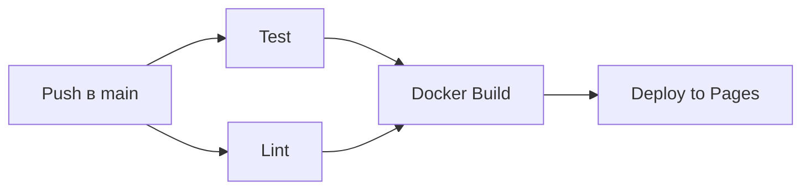
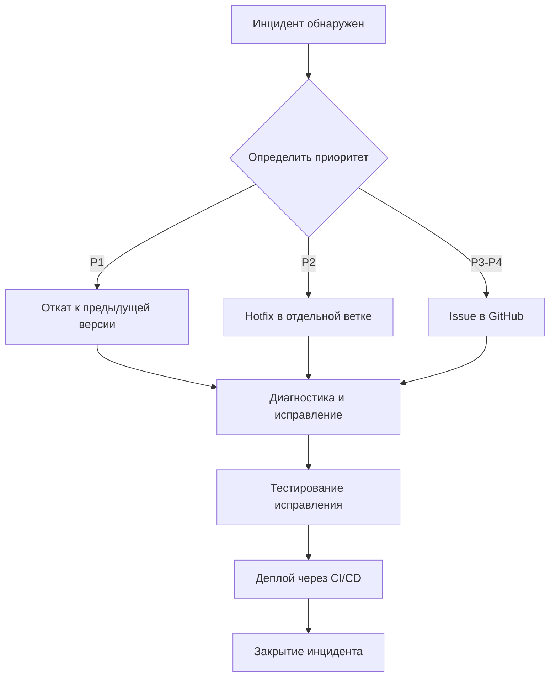

# Этап 6. CI/CD, релиз и поддержка инцидентов

**Тема проекта:** Сервис фитнес-клуба (Абонементы, тренировки и посещаемость)  
**Дата выполнения:** 02.06.2026  
**Репозиторий:** [github.com/valtureso788/Fitness-03](https://github.com/valtureso788/Fitness-03)

---

## 1. Цель этапа

Настроить непрерывную интеграцию и доставку (CI/CD), оформить релиз проекта, описать процедуру поддержки инцидентов.

---

## 2. CI/CD пайплайн

### 2.1. Обзор

Файл: `.github/workflows/ci-cd.yml`

Пайплайн запускается автоматически при каждом `push` или `pull request` в ветку `main`.

### 2.2. Этапы пайплайна



| Job | Что делает | Зависимости |
|:---|:---|:---|
| **test** | Запуск 21 теста через Node.js | — |
| **lint** | Проверка HTML-структуры и JS-синтаксиса | — |
| **docker** | Сборка образа, запуск контейнера, curl-проверка | test, lint |
| **deploy** | Публикация app/ на GitHub Pages | docker |

### 2.3. Конфигурация

```yaml
on:
  push:
    branches: [main]
  pull_request:
    branches: [main]
```

---

## 3. Релиз v3.0

### 3.1. Что вошло в релиз

| Компонент | Описание |
|:---|:---|
| Приложение | SPA с 5 модулями, 3 ролями, адаптивный дизайн |
| Docker | Контейнеризация на nginx:alpine |
| CI/CD | GitHub Actions (4 jobs) |
| Тесты | 21 автоматизированный тест |
| Безопасность | 5 заголовков безопасности, CSP |
| Документация | README, 6 этапов, структура |
| Скрипты | start.bat, test.bat, Makefile |

### 3.2. Метрики релиза

| Метрика | УП.02 (до) | УП.03 (после) | Δ |
|:---|:---|:---|:---|
| Файлов в проекте | 4 | 14+ | +250% |
| Строк кода | ~1 700 | ~2 200 | +30% |
| Тестов | 0 | 21 | +21 |
| Docker | ❌ | ✅ | Новое |
| CI/CD jobs | 0 | 4 | +4 |
| Заголовки безопасности | 0 | 5 | +5 |
| BAT/Makefile | 0 | 3 | +3 |

---

## 4. Процедура поддержки инцидентов

### 4.1. Классификация инцидентов

| Уровень | Описание | Время реакции | Пример |
|:---|:---|:---|:---|
| 🔴 P1 — Критический | Приложение недоступно | 1 час | Падение контейнера |
| 🟡 P2 — Высокий | Модуль не работает | 4 часа | Ошибка авторизации |
| 🟢 P3 — Средний | Визуальный баг | 1 день | Сломалась вёрстка |
| ⚪ P4 — Низкий | Пожелание | 1 неделя | Добавить фичу |

### 4.2. Алгоритм обработки инцидента



### 4.3. Команды диагностики

| Ситуация | Команда |
|:---|:---|
| Контейнер не запускается | `docker logs fitclub-app` |
| Проверка статуса | `docker inspect fitclub-app` |
| Перезапуск | `docker-compose restart` |
| Откат | `git revert HEAD && git push` |
| Проверка тестов | `node tests/run-tests.js` |

---

## 5. История версий

| Версия | Дата | Описание |
|:---|:---|:---|
| v1.0 | 24.04.2026 | УП.02: базовая реализация SPA |
| v2.0 | 05.05.2026 | УП.02: полная документация, 12 этапов |
| **v3.0** | **02.06.2026** | **УП.03: инженерная версия — Docker, CI/CD, тесты, безопасность** |

---

## 6. Вывод

Настроен полноценный CI/CD пайплайн из 4 этапов (test → lint → docker → deploy), автоматически запускающийся при каждом push. Оформлен релиз v3.0 с Docker-контейнеризацией, 21 тестом, 5 заголовками безопасности и полной документацией. Описана процедура поддержки инцидентов с классификацией по приоритетам и алгоритмом обработки.
